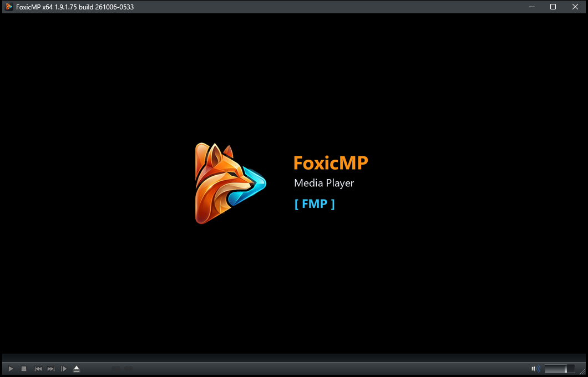

# FoxicMP



FoxicMP — свободный проигрыватель аудио и видео для Windows, основанный на [MPC-BE](https://github.com/Aleksoid1978/MPC-BE). Это независимая модификация с отдельным именем приложения, профилем и интеграцией с Windows.

## Особенности

- Полностью автономный профиль: настройки, история и пользовательские данные хранятся рядом с программой.
- FoxicMP не использует профили MPC-BE или MPC-HC.
- Пункт FoxicMP для всех видеофайлов можно включить в разделе «Форматы»; приложение проверяет правильность пути при запуске.
- Компактная нижняя панель объединяет основные кнопки, состояние воспроизведения, время и громкость.
- Главы показаны тонкими вертикальными линиями на всей высоте шкалы времени; название главы отображается при наведении.
- В комплект входят portable-пакет и установщик для Windows.

## Загрузка

Готовые сборки публикуются на странице [Releases](https://github.com/LiberVixer/FoxicMP/releases). Для большинства 64-разрядных систем Windows используйте пакет x64.

## Системные требования

- Windows 7, 8, 8.1, 10 или 11.
- Процессор с поддержкой SSE2.
- Видеокарта с поддержкой DirectX 9.0c и Pixel Shader 3.0.

## Сборка

Инструкция находится в [docs/Compilation.txt](docs/Compilation.txt). Основная команда для создания пакетов:

```bat
build.bat Build x64 Packages NoWait
```

## Происхождение и лицензия

FoxicMP основан на MPC-BE и сохраняет историю исходного проекта и сведения об авторах. Изменения FoxicMP впервые опубликованы в 2026 году. Исходный код распространяется на условиях [GNU GPL v3](LICENSE.txt). Список авторов и используемых компонентов находится в каталоге [docs](docs).

---

FoxicMP is a free and open-source audio and video player for Windows based on [MPC-BE](https://github.com/Aleksoid1978/MPC-BE). It is an independent modification with its own application identity, portable profile, and Windows integration.

Settings and user data are stored next to the executable. Release packages and source code are distributed under the [GNU GPL v3](LICENSE.txt). Build instructions are available in [docs/Compilation.txt](docs/Compilation.txt).
